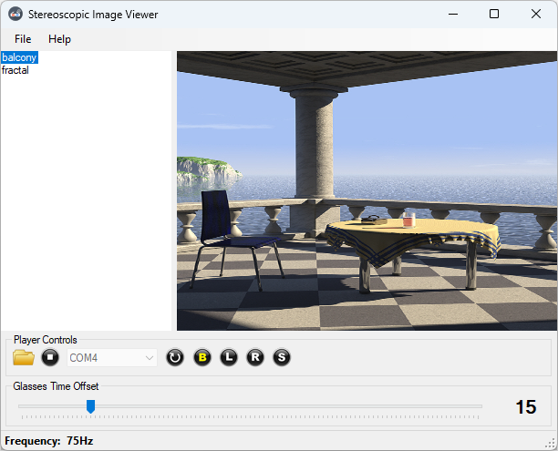

# Stereoscopic Image Viewer
SoftCollection Stereoscopic Image Viewer allows you to view stereo images on a regular screen of PC.
It consists of two projects:
1. Stereoscopic Image Viewer for Windows.
   This software can load two images, one for left eye and one for right eye and show them alternatively 60 - 144 times a second.
   After each image is shown, the corresponding information is sent to Arduino Project via Serial COM Port.
   The information determines which shutter on the Glasses must be opened and which must be closed.
   When left-eye image is shown, left shutter is opened and right shutter is closed.
   When right-eye image is shown, right shutter is opened and left shutter is closed.

2. 3D Glasses controller Arduino project. 
   This project gets information that was sent from the Windows project above and opens / closes shutters on 3D Glasses.
   The shutters must be connected directly to Arduino board using cable.

**Please note:** In the folder with stereo images, image for left eye must have extension **.left.png** and image for right eye must have extension **.right.png**
For example: **my_photo.left.png** and **my_photo.right.png**

